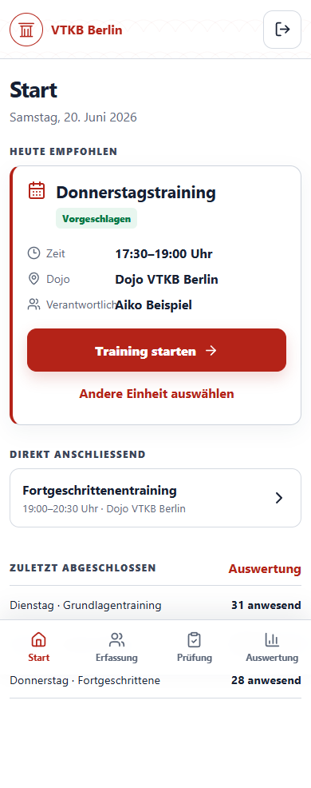
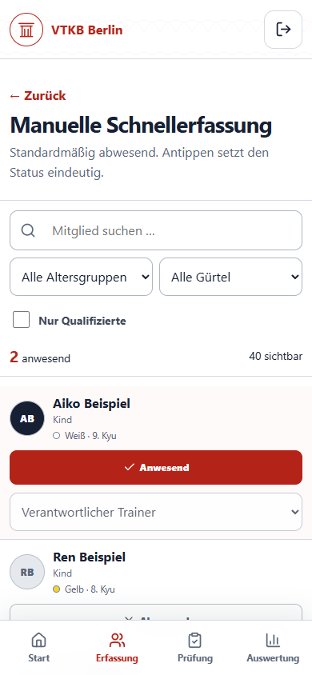
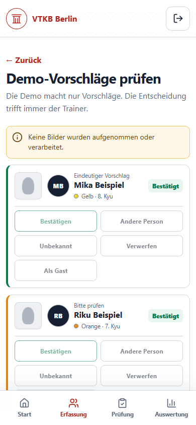
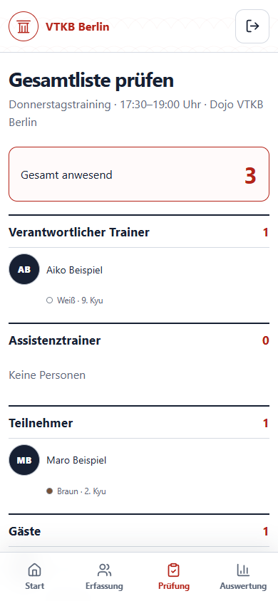

# Paket 1 · Lokaler UX-Prototyp

- Datum: 2026-06-20
- Status: lokal implementiert und geprüft
- Branch: `feature/package-1-ux-prototype`
- Cloudaktionen: keine
- Deployment: keines

## Umgesetzter Umfang

- React-/TypeScript-/Vite-PWA im Workspace `@vtkb/web`.
- Smartphone-first-Oberfläche in Weiß, Anthrazit und VTKB-Rot mit Tastaturfokus, großen Touch-Zielen und responsivem Desktop-Rahmen.
- 40 eindeutig fiktive Mitglieder mit Altersgruppe, Gürtelgrad/-farbe und dauerhafter Qualifikation.
- Mehrere Trainingseinheiten mit zeitbasierter Empfehlung und freier Auswahl.
- Genau ein verantwortlicher Trainer, optional mehrere Assistenztrainer; Trainingsfunktion setzt Anwesenheit und erzeugt keine Doppelzählung.
- Vollständige manuelle Schnellerfassung mit Suche, Filtern, Einzelumschaltung, Rollenänderung und manuellen Gästen/Probetraining.
- Rein lokale Fotoassistenz-Demo mit drei abstrakten Aufnahmebereichen, simulierten Vorschlägen, eindeutigen/unsicheren/unbekannten/Dubletten-Fällen und verpflichtender Trainerentscheidung.
- Prüfbare Gesamtliste, fachlich gesperrter Abschluss bei offenen Vorschlägen und lokale Abschlussansicht.
- Interne Demo-Auswertung mit fiktiven aggregierten Statistiken.
- Installierbare PWA-Grundlage mit Manifest und generiertem Service Worker.

## Bewusst nicht umgesetzt

- kein Backend, keine Datenbank und keine dauerhafte Speicherung,
- kein produktiver Login und keine Autorisierung,
- keine Kamera, keine Bildaufnahme, kein Upload und keine Gesichtserkennung,
- keine biometrische Enrollment-ID für Gäste,
- keine AWS-, Terraform-, Rekognition- oder Deployment-Aktion,
- keine produktive Einwilligungsverwaltung und keine Verarbeitung echter Personen.

## Lokaler Start

Empfohlen wird Node.js 22.12 oder neuer innerhalb der Engine-Vorgabe `^20.19.0 || ^22.12.0 || >=24.0.0`.

```powershell
npm ci
npm run dev
```

Build und lokale Vorschau:

```powershell
npm run build
npm run preview
npm run qa:browser
```

Für `npm run qa:browser` muss die Vorschau in einem zweiten Terminal unter `http://127.0.0.1:4173` laufen.

## Ausgeführte Abschlussprüfung

Ausführungsumgebung: Node.js `v24.14.0`, npm `11.4.2`.

| Befehl                 | Ergebnis                                                               |
| ---------------------- | ---------------------------------------------------------------------- |
| `npm ci`               | erfolgreich, 590 Pakete installiert, 0 Schwachstellen                  |
| `npm run format:check` | erfolgreich                                                            |
| `npm run lint`         | erfolgreich                                                            |
| `npm run typecheck`    | erfolgreich                                                            |
| `npm test`             | erfolgreich, 4 Testdateien und 28 Tests                                |
| `npm run check`        | erfolgreich; Format, Lint, Typecheck und 28 Tests erneut bestanden     |
| `npm run build`        | erfolgreich, Vite-Produktionserzeugnis und PWA-Service-Worker erstellt |
| `npm audit`            | erfolgreich, 0 Schwachstellen                                          |
| `npm query .workspace` | erfolgreich, alle vier erwarteten Workspaces erkannt                   |
| `npm run qa:browser`   | erfolgreich, fünf Viewports, zwei Hauptabläufe, keine Konsolenfehler   |

Der erste `npm ci`-Versuch scheiterte an einem Windows-Dateilock des zuvor gestarteten lokalen Vite-Prozesses. Nach dem gezielten Beenden dieses Prozesses wurde `npm ci` erfolgreich wiederholt; es war keine Quellcodekorrektur dafür erforderlich.

## Automatisierte Tests

Die Paket-1-Tests decken insbesondere ab:

- Vorschlag einer passenden Trainingseinheit,
- verantwortliche Trainingsleitung als Abschlussvoraussetzung,
- keine Doppelzählung von Assistenztrainern,
- vollständige manuelle Erfassung und lokales Speichern,
- manuelle Gäste ohne biometrische Felder,
- Sperre bei ungeklärten Foto-Demovorschlägen,
- mobile Hauptnavigation,
- exakt 40 fiktive Mockmitglieder.

Zusammen mit Paket 0 bestehen 28 Tests in vier Testdateien.

## Browser- und Responsive-Prüfung

Der bevorzugte eingebettete Browser wurde initial erfolgreich verbunden, brach nach einer Benutzerunterbrechung jedoch wegen fehlender Sitzungs-/Sandbox-Metadaten ab. Die reproduzierbare Abschlussprüfung wurde deshalb mit dem vorhandenen Playwright 1.60.0 und lokalem Microsoft Edge ausgeführt.

Geprüfte Viewports:

| Viewport | Größe      | Horizontaler Überlauf |
| -------- | ---------- | --------------------- |
| Mobile   | 375 × 812  | keiner                |
| Mobile   | 390 × 844  | keiner                |
| Mobile   | 430 × 932  | keiner                |
| Tablet   | 768 × 1024 | keiner                |
| Desktop  | 1280 × 900 | keiner                |

Der Ablauf Start → Trainingsleitung → manuell bzw. Foto-Demo → Zusammenfassung → lokaler Abschluss wurde geprüft. Die Foto-Demo griff nicht auf eine Kamera zu, alle Vorschläge mussten geklärt werden, der Gast blieb biometriefrei und die Browserkonsole enthielt keine Fehler. Die maschinenlesbaren Ergebnisse stehen in [screenshots/package1/qa-results.json](screenshots/package1/qa-results.json).

Ausgewählte Ansichten:









## Gestaltungsgrundlage

Der vor der Implementierung erzeugte visuelle Konzeptentwurf liegt unter [reference/diagrams/package1_ux_concept.png](reference/diagrams/package1_ux_concept.png). Die Implementierung übernimmt dessen klare mobile Informationshierarchie, die VTKB-Farbwelt, abstrakte neutrale Avatare und die hervorgehobenen Hauptaktionen, ohne echte Personen oder Fotografien zu verwenden.

## Grenzen des Prototyps

- Zustände leben nur im aktuellen Browser-Tab und gehen beim Neuladen verloren.
- Die zeitbasierte Empfehlung arbeitet ausschließlich mit lokalen Mockeinheiten.
- Die PWA ist installierbar, besitzt aber noch keine produktive Offline- oder Synchronisationslogik.
- Statistikwerte sind fiktiv und nicht aus gespeicherten Anwesenheiten berechnet.
- Datenschutz-, Rollen- und Validierungsregeln werden im Frontend demonstriert; produktive Durchsetzung benötigt spätere Backend-Pakete.

## Stoppgrenze

Paket 2 wurde nicht begonnen. Es wurden weder AWS-Ressourcen verändert noch Terraform- oder Deployment-Befehle ausgeführt.
